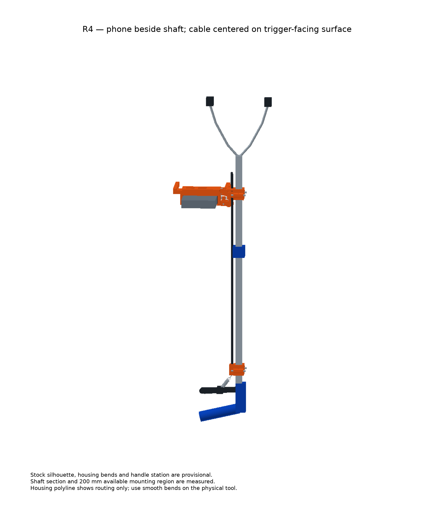
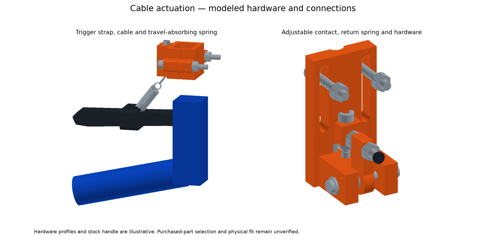

# Too Much Trash

**Every piece of litter is a chance to teach a robot how to help.**

Too Much Trash is an experiment in collecting the kind of real-world experience autonomous cleanup robots need: what debris looks like from a gripper’s point of view, how a hand approaches it, and what happens when a grasp succeeds or fails. The goal is a practical, growing dataset of everyday pickup attempts in messy environments, followed by perception and imitation-learning research that can turn those examples into useful robotic behavior.

The collection tool starts with an ordinary reacher grabber. A lightweight, 3D-printed mount places an iPhone near its claw so the camera sees the approach and grasp. A mechanical pull cable connects the stock handle trigger to a small actuator at the phone’s volume button. Each squeeze marks a grasp event while a rolling video buffer preserves the moments before contact. The mechanism is designed to leave the grabber’s internals alone and avoid additional electronics.

The person collecting litter holds a separate bucket in their other hand. A successful deposit into that bucket provides a useful signal that the object was picked up and accepted as trash; misses, drops, and rejected objects are valuable examples too. Those signals are starting points for labeling, not a claim that every outcome can be inferred perfectly without review.

This repository brings the whole effort together: a hosted service for collecting and processing media, desktop and browser experiences for reviewing it, a dedicated iOS experience for capture and review, a workspace for segmentation and classification experiments, and an editable CAD design for the grabber retrofit.

## The current prototype

These images come directly from the current 3D CAD assembly. The adjustable holder keeps the phone beside the shaft and its screen open. A cable-driven actuator presses the volume button; a spring at the handle absorbs the rest of the squeeze.

Orange marks printable retrofit parts; blue marks the stock handle and brace. This is a **fit prototype**: the printable parts are modeled, while the stock tool, phone and purchased hardware remain illustrative references. Physical grip, button force and spring behavior still need verification.

The [CAD guide](cad/README.md) includes editable models, printable files, a bill of materials and assembly instructions. The [original concept drawings](cad/renders/README.md) are preserved as the project's design history.

The aspiration is simple: make it easier to gather honest examples of litter pickup at scale, learn from the awkward attempts as well as the clean ones, and help future robots do more of the work of keeping shared spaces clean.
