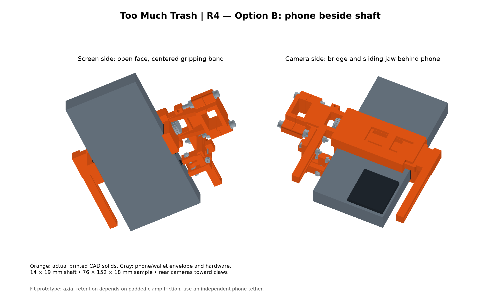
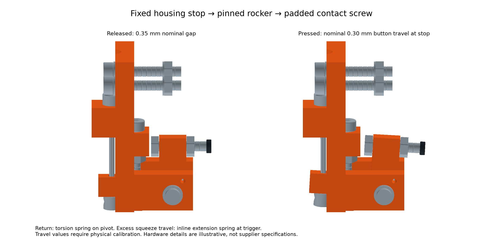

# R4 — adjustable reacher phone retrofit

Editable **fit prototype**, based on the [confirmed measurements](reference/measurements.md). Six unique printed designs make seven pieces, down from eleven in R2. One carrier integrates the fixed jaw, rectangular shaft saddle and near-side actuator rail. One sliding jaw accommodates different phone widths and thicknesses; a separate compact rocker module adjusts to the volume-up button on either side. The source and exports are real CadQuery solids. Physical reliability remains to be established.



[Corrected rear landscape placement: camera lower left, volume up and demo actuator on upper edge](print/rear-landscape-cad.png).

## Fit and operation

The same print set covers a provisional **66–86 mm outside width, 7.5–20 mm thickness**, and volume-button location **80–125 mm from the charging edge**, subject to its center also being **25–65 mm toward the camera end from the phone midpoint**. Both the bare 15 Pro sample (70.6 × 146.6 × 8.25 mm) and wallet-case sample (76 × 152 × 18 mm) are modeled. This is an envelope, **not a verified iPhone 14–18 compatibility list**. Camera bumps, rounded sides, cases and button force must be checked individually.

Two flat opposing jaws clamp replaceable 0.8 mm side pads. Rear ledges with pads locate the camera-side face; the bridge and sliding tongue sit behind that face, leaving the screen open. A metal M4 draw screw adjusts width. Narrow front lips act as escape catches, but have substantial clearance on thin phones: **out-of-plane and lengthwise retention depend on pad friction**, not a close-fitting cage. Use an independent tether. Dummy-phone testing was declined by the user; retention remains physically unverified. Pads must bear on the case/frame, not display glass.

**Option B is the selected layout:** the phone remains beside the shaft, with no shaft/phone intersection. The 24 mm gripping band is centered along phone length, so equal lengths extend beyond it. This balances length about the band; it does not eliminate the lateral moment caused by a phone beside the shaft. The default actuator is on the edge nearest the shaft, with the camera envelope on the opposite edge. The same bracket and rocker can be installed on the far-side rail without mirrored prints; see [both configurations](print/actuator-sides-cad.png) and `assembly-far-side.step`. Confirm the centered band misses the other phone buttons.

The phone rear faces the claws, with its charging edge toward project +Z; the phone protrudes to the negative-X side of the shaft. Local CAD axes map **(X, Y, Z) → project (X, Z, −Y)**. The measured shaft is **14 mm project X × 19 mm project Z**. Mount within the measured 200 mm straight region above the blue brace, with clearance from the complete claw sweep.

## Button mechanism



The outer housing seats in a stepped ferrule bore on the adjustable bracket. The inner wire passes through the rocker input arm and terminates in a purchased screw-on cable stop on the side away from the housing. Cable pull rotates the rocker on a metal pivot. A padded M3 contact screw presses volume up; two opposed nuts lock the contact setting. A torsion spring returns the rocker to its released ledge. An adjustable M3 stop limits rotation and transfers excess load into the bracket.

A **purchased extension spring in series between the handle-end cable loop and trigger strap** absorbs the rest of the squeeze stroke after the rocker reaches its stop. It is necessary: a brake cable directly linking 20–40 mm trigger travel to a sub-millimetre phone button would otherwise bind or overload something. The button remains pressed until the trigger is released.

The [generated calculation](print/validation.json) uses provisional 0.35 mm rest gap and 0.30 mm button stroke: about **3.2° rotation and 1.0 mm cable travel**. With the upper-trigger tie aligned to the centered housing outlet, the calculation assumes 20–40 mm axial take-up, requiring approximately **39 mm spring extension** at full stroke. Actual take-up depends on the measured moving tie point and must be checked physically. See [design review](design-review.md) for force assumptions and calibration.

## Assembly

1. Deburr prints, check slider movement and ream metal-pivot/fastener holes as needed. Apply thin removable shaft shims and jaw pads. Install the M4 square nut in the jaw's top-loading pocket; insert the jaw from the open right end of the guide.
2. Insert the M4×80 draw screw from the fixed-jaw side into the jaw nut. Use a purchased thumb head no larger than 16 mm diameter / 5 mm thick; the carrier has a finger recess. Backing off permits manually spreading the jaws. Center the phone length on the jaw band, seat its rear against the padded ledges, and tighten only enough to resist slipping. Attach the independent tether.
3. Bolt the integrated saddle and one `neck_cap` around the rectangular neck. Fit the second cap to `handle_anchor` above the handle. Each collar uses two M4 through-bolts and washers. Do not crush the fluted tube; physical shim fit controls friction.
4. Choose the carrier rail or matching sliding-jaw rail and attach the same bracket to its slot using two M3 bolts and 6 mm OD ×0.5 mm washers. Use M3×20 carriage bolts (replacing the earlier M3×25 callout) and verify tip clearance at the chosen adjustment. Slide it along the phone and adjust its height through the paired vertical slots, then lock both bolts. Wallet-case button center is 6 mm from the screen side; the rear ledges locate the 18 mm case at a fixed rear datum. Leave the camera keep-out area unobstructed.
5. Install the pivot, torsion spring and rocker with axial washers. Set spring legs in their provided holes, with preload toward the released stop; ensure no coil/leg rubbing. Install the contact screw with a soft tip and opposed locknuts, and the stop screw with its square nut plus locking nut.
6. Seat housing/ferrules at both reaction stops. Route the housing down the center of the neck face facing the black trigger; the handle anchor outlet and upper-trigger Velcro tie are in the same plane. Use smooth bends (follow the selected housing supplier’s bend-radius limits; the schematic two-turn loop may need more space), away from claws and fingers. Secure with removable ties. The CAD route is a diagram with straight segments, not a cut/bend template.
7. Secure the handle inner wire to the series spring with a rated clamp/loop termination. Connect the spring's closed eye to a hook-and-loop strap on the **moving trigger**. Keep all metal ends covered and clear of the hand. Do not attach it to the stationary grip. Verify strap security through the full squeeze.
8. Calibrate the adjustable mechanism: eliminate unintended preload, set a small release gap, then limit the rocker stroke with its stop. Adjust cable slack so it releases reliably after every squeeze. Confirm full claw closure still occurs as the series spring extends. Approach the phone button with a conservative stop setting. Do not assume 0.30 mm is safe for a particular phone/case.

## Print and materials

STLs in `print/` are **already oriented and translated onto the bed**, in mm. Import the six files into Bambu Studio as separate objects and make two copies of `neck_cap`. The largest bounding box fits a 180 mm consumer bed. Individual STEP parts retain source coordinates; the STEP assembly applies installation transforms.

| Part | Qty | Material / orientation / support |
| --- | ---: | --- |
| `carrier` | 1 | PETG; broad bridge/rail underside down. Four walls, 25–35% infill. Local support below collar bolt ears and front catch lips; 2.3 mm guide overhangs need inspection in preview. |
| `sliding_jaw` | 1 | PETG; tongue underside down. Four walls, 30% infill; six walls around nut and draw-screw web. Support the small front catch lip; keep guide faces clean. |
| `neck_cap` | 2 | PETG; shaft axis vertical. Four/five walls; support beneath bolt ears. |
| `actuator_bracket` | 1 | PETG; exported on cable-stop outer face. Paint support beneath raised back plate/pivot ears, keep slots and ferrule bore clear. Five walls. |
| `rocker` | 1 | PETG; exported flat on its broad face, pivot axis vertical. Five walls / solid small part; no support. |
| `handle_anchor` | 1 | PETG; shaft axis vertical. Five walls; local ear support. |

Start with 0.4 mm nozzle, 0.2 mm layers. For the initial prototype, use existing PLA/PLA+ for all seven rigid pieces, or PETG if preferred. The table above gives the later PETG structural baseline. After acquiring TPU, use it for separate compliant pads, liners and contact caps; these accessory STL designs are not yet included. See the [per-part, two-stage BOM](bom.md). Initially cut pads/shims from rubber sheet and use a purchased soft contact cap. Recheck fits when switching material; PLA/PLA+ has not been qualified as equally durable. No brand-specific PLA+ assessment is required; metal carries pivot wear, cable tension and threads. Avoid brittle or heat-softened structural prints. Slide clearances are 0.3 mm per side / 0.4 mm vertically; collar adds 0.6 mm total per axis before shims. Fit depends on printer and material. Slice previews and actual print times/mass have **not** been validated in Bambu Studio. Manifest volumes are solid CAD volumes, not slicer material estimates.

## Files and regeneration

- `source/parameters.py`: measured samples and clearly marked provisional settings.
- `source/parts.py`: individual editable printable solids; `assembly.py`: shared placement and mechanism math.
- `source/build.py`, `render.py`: exports and actual-CAD illustrations.
- `source/check_design.py`: static/swept collision and analytic travel checks.
- `print/`: current STL/STEP files, assembly meshes, drawings, manifest and validation report.
- [BOM](bom.md), [design review](design-review.md), [measurement record](reference/measurements.md).
- `archive/r2/`: superseded prior CAD and exports. Tag `cad-r3-first-draft` preserves the full R3 draft before this review. `renders/`: original concept art, unchanged.

The project-local workflow uses Python 3.12, [CadQuery 2.6.1](https://github.com/CadQuery/cadquery/tree/v2.6.1), and exact dependencies in `uv.lock`. CadQuery's Git commit is pinned in the lockfile. With `uv` installed, from `cad/`:

```sh
uv sync --frozen
uv run --frozen python source/check_design.py
uv run --frozen python source/build.py
uv run --frozen python serve_viewer.py
# Open http://localhost:8765/viewer.html in Chrome
```

Only `cad/.venv` is used; no global Python packages are required. Export behavior follows [CadQuery's export documentation](https://cadquery.readthedocs.io/en/latest/importexport.html). Edit the sample settings to visualize another phone; the same printable geometry remains unchanged inside the stated envelope. Revising the mechanism/fit envelope itself requires reviewing the associated geometry and repeating validation.

## Hardware shown in gray/white

See [the purchased BOM](bom.md) for quantities and provisional sizes. Metal references now include recognizable heads, nuts, washers and cosmetic thread marks. These are assembly illustrations, not supplier drawings:

- Four collar bolts close the phone and handle clamps around the shaft.
- The long M4 draw screw and its thumb wheel pull the sliding jaw inward; a captive square nut reacts it.
- Two M3 carriage bolts and 6 mm OD washers lock the actuator's position in its adjustment slots.
- One smooth metal pivot axle supports the rocking lever.
- One M3 contact screw with two locknuts carries the soft button tip.
- One M3 stop screw and its nuts limit lever travel.
- The short cylinder on the lever is a **removable screw-on cable stop**, not a modeled factory cable nipple. The bare inner wire passes through the 2.2 mm lever hole; the stop clamps to the wire on the far side and bears against the lever when pulled. The fixed bracket separately anchors the housing/ferrule and reacts its compression.
- The pivot spring returns the lever. The inline extension spring near the trigger takes up excess squeeze travel.

Other purchased items are inner cable, outer housing, two ferrules, cable end/loop terminations, hook-and-loop trigger strap, removable route ties, jaw pads, shaft shims, soft contact cap and phone tether. Their dimensions and spring shapes are envelopes pending hardware selection; they are not printable components. A factory cable nipple like the supplied photo could replace the screw-on stop only after checking its shape, bearing area and clearance.

The housing now follows three straight segments with two right-angle turns in CAD. Actual brake housing must make rounded bends at those locations; the drawing is not a specification to kink the housing. Cable length and loop clearance depend on the chosen housing.

Material basis: [Prusa’s PETG guide](https://help.prusa3d.com/article/petg_2059) recommends PETG for mechanical holders and clamps; its [PLA guide](https://help.prusa3d.com/article/pla_2062) notes lower heat resistance and brittleness. PETG is the design baseline, not a certification of strength. The user chose to proceed without a brand-specific PLA+ assessment. Proposed rigid knobs and housing guides can also use PETG; flexible pads must remain compliant purchased components with the currently owned filaments.

## Unified viewer bill of materials

The **Bill of Materials** tab combines material-colored printable models, hardware representatives and one complete assembly table loaded from `bom.md`. Each item is counted once. Rows distinguish required, fit-dependent, recommended and optional items, with initial and later material/supply choices. Future printed alternatives replace the corresponding purchased items; the draw-screw row already includes its thumb head. The table gives actual required quantities; the 3D display shows representatives and individually scales hardware for visibility. Thread marks, strand lay, retainers and textile details are simplified; select actual hardware before relying on its dimensions.

### Interactive material assignment

In the BOM, check **PLA/PLA+**, **PETG**, and/or **TPU** under “Preferred materials on hand.” The single **Material** column and model colors update together. PETG takes priority for rigid parts, then PLA/PLA+ for an initial prototype. TPU applies to proposed soft accessories; it does not substitute for rigid structure. With neither PETG nor PLA selected, the viewer flags the missing rigid material. Purchased hardware and textiles remain purchased.

**Most Optimal Layout** disables the material checkboxes and recommends PETG structure plus TPU soft accessories. Turning it off restores the previous on-hand selections. “Layout” changes material assignment only; no geometry or structural qualification changes. The ordinary assembly retains the project's orange retrofit color convention. Planned accessory STLs stay explicitly marked unavailable, with current purchased alternatives shown. `material_strategy.js` contains the choice logic; `bom.md` remains the source for quantities, requirement status and purposes.

### Component navigation and model availability

Click a BOM row or model to focus and highlight it without leaving the BOM. Right-click a row/model to open the available Phone assembly, Full tool or Actuator view, focused on that component. Unavailable destinations are disabled. Use **Show all** to reset framing. Rows also support Enter/Space and Shift+F10.

The **3D model** column distinguishes printable STLs, reference envelopes and table-only items. Jaw pads and the soft contact tip have reference geometry; shaft liners/shims, optional trigger saddle and cable-retaining loops do not yet have models. Selecting TPU does not create geometry or export new STLs.

### Full-tool squeeze animation

The black stock trigger is a separate, non-printable CAD envelope with a transverse pivot. The **Lever stroke** slider rotates it toward the fixed blue grip; its strap moves with it. The handle cable stays connected, the phone rocker reaches its stop after approximately 1 mm of illustrated cable take-up, and the series-spring envelope lengthens during the remaining squeeze. The phone-end inner wire also follows the rocker.

The stock contour, pivot and 27.5° display sweep are provisional, not measured mechanism geometry. This is a prescribed kinematic illustration, not a force/friction simulation or proof of the measured 20–40 mm trigger travel. The extension spring is displayed with helical wire and closed eyes; its coil spacing increases during squeeze while its wire diameter and eye size remain constant. The torsion return spring has a helical coil around the pivot and two legs. Coil dimensions and turn counts are illustrative, not specifications for a validated purchased spring. The trigger is already part of the purchased reacher and adds no BOM item or printable part.

### Hardware visualization pass

Purchased-part references now show socket-head bolt sets with washers and hex nuts, a grooved thumb head, smooth retained pivot, contact/stop screws, a bored cable stop, hollow ferrules and housing, simplified seven-strand cable, rounded pads, a hollow soft tip and a looped trigger strap with an overlap tab. Springs retain their helical geometry. `source/hardware_visuals.py` defines these details; the actuator bracket now includes an extended housing-entry relief (3.8 mm backing) and a narrower housing boss (2 mm side walls), while the carrier has a small guide-end clearance for the far-side fasteners on narrow phones. The other four printable designs are unchanged. The cable stop's side recess indicates the clamping screw location; the exact clamp and handle loop termination still need selection.

The BOM displays the thumb head with its screw and the return-spring legs with their coil. Shaft liners, route ties, optional saddle and tether still have no modeled geometry. The drawings do not imply that those optional printable replacements are ready.

## Recommended first print

Proceed to a **fit prototype**, after slicing and reviewing supports; further cosmetic rendering is not a prerequisite. Use existing PLA/PLA+ for this first pass. Start with one neck cap, the rocker and actuator bracket to check the shaft profile, pivot hole, spring seats and ferrule/fastener interfaces. A neck cap alone checks profile fit, not clamp retention. Then print the carrier, sliding jaw, handle anchor and second cap to evaluate the assembled clamp and slider. Keep print orientations and support guidance above.

Before operating against the phone, assemble the cable and actual metal springs off the phone and verify stop engagement, return and full trigger travel without binding. Spring sourcing and the actuator's lateral contact sweep remain unresolved physical checks. No dummy-phone test is required. Review Bambu Studio's sliced layers, supported ears/lips, nut pockets and sliding surfaces before sending the plate; see [Bambu's support guidance](https://wiki.bambulab.com/en/software/bambu-studio/support). A successful render or watertight STL is not a slicer approval.
