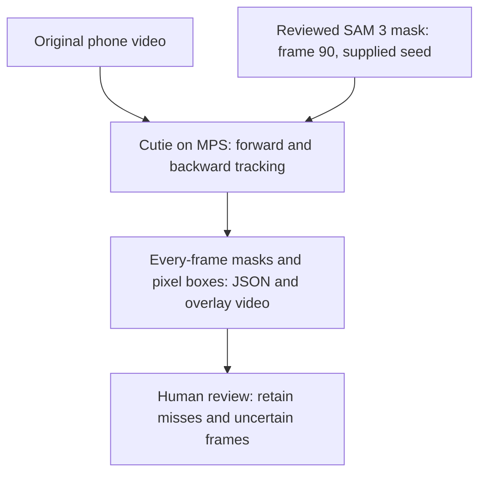

# SAM 3 litter segmentation lab

This is an image experiment for testing whether text-prompted [Meta SAM 3](https://github.com/facebookresearch/sam3) can find litter in phone frames. It uses the [Transformers SAM 3 integration](https://huggingface.co/docs/transformers/model_doc/sam3) in a browser viewer. Keep every miss and uncertain prediction in later evaluations; a mask is only a proposed label.

## Access and hardware

The official [`facebook/sam3` checkpoint](https://huggingface.co/facebook/sam3) requires Meta approval and Hugging Face authentication. Request access on that page, then run `uv run hf auth login` locally or set `HF_TOKEN` in your shell. Never commit the token or downloaded weights. The model has 848 million parameters; use a CUDA GPU for serious throughput. The native app selects CUDA, Apple MPS, then CPU. Docker Desktop on macOS cannot expose the Mac's MPS GPU to Linux containers, so native mode is preferable there. The container is useful for a browser-facing CPU demo or a Linux GPU deployment after adapting its PyTorch base to CUDA.

## Native setup

From this directory:

```sh
uv sync
uv run sam3-download
uv run sam3-viewer
```

Open <http://127.0.0.1:7860>. The model loads on the first segmentation request.

The Video tab accepts a playable upload, an object phrase, a score threshold, and a processing policy (every frame, 1 FPS, or one frame every 4/5 seconds). Click **Segment video** to produce a silent H.264 preview and downloadable JSON. Sampled previews hold each processed snapshot until the next one; they do not track objects or apply an old mask to later moving frames. Each JSON frame records the actual source frame index and timestamp, scores, source-pixel `box_xyxy` coordinates, and exact binary mask shapes as row-major run-length counts (alternating zeros/ones, starting with zeros). Empty instance lists preserve zero detections. Native outputs are saved in Git-ignored `ml/data/sam3-viewer/`; `SAM3_OUTPUT_DIR` overrides that directory.

To preload the shortest downloaded sample on the current native port:

```sh
SAM3_PORT=7861 \
SAM3_SAMPLE_VIDEO="$(pwd)/../../data/sam3-evaluation/2026-10-07/JCF0TEGO.mp4" \
uv run sam3-viewer
```

Use the player's trim control to focus on a pickup interval before processing. The shortest sample is 25.9 seconds; its annotated towel action is around 10.7–16.0 seconds. Sparse sampling can skip the brief view of the towel, so try a trimmed interval at 1 FPS when reviewing shape quality. The image and video requests share one inference queue to avoid simultaneous model calls.

To serve native MPS inference to containers on Docker Desktop, use:

```sh
SAM3_PORT=7861 uv run sam3-viewer
```

The browser uses <http://127.0.0.1:7861>; container clients use `http://host.docker.internal:7861`. Docker Desktop connectivity to this loopback-only viewer was verified with HTTP 200 and an upload/predict request on 2026-10-07 (one grabber mask, score 0.9498, 4.80 seconds on MPS); binding all network interfaces was unnecessary. The Gradio upload/predict API can be called with `gradio_client.Client` and `api_name="/predict"`. The model runs natively on the Mac even when the caller is in a container.

Try focused phrases such as `plastic bottle`, `aluminum can`, `paper cup`, and `food wrapper`; compare false positives, misses, timing, and score thresholds on the same frame. Generic `trash` may not correspond to the visible material or object type. Save source frame IDs and human review notes outside Git in `ml/data/`.

## Docker viewer

From this directory, after `HF_TOKEN` is set and Docker is running:

```sh
docker compose build
docker compose run --rm viewer sam3-download
docker compose up -d
```

Open <http://127.0.0.1:7860>. The named volume keeps the model cache across container restarts. `docker compose down` stops the lab. A Linux NVIDIA host needs a CUDA-enabled PyTorch image and GPU device reservation before expecting GPU inference; the included image is a portable CPU baseline.

## First evaluation record

Use original egocentric frames, including clear litter, clutter, non-litter lookalikes, occlusions, and failures. Record each prompt, threshold, model revision, latency, candidate mask, and whether a person accepts it. Do not infer grasp success or bucket deposit from a single segmentation mask.

## Inference smoke test

On 2026-10-07, the approved checkpoint downloaded and native inference completed on Apple MPS. The test used `cad/reference/reacher-grabber.png` with the prompt `reacher grabber` and score threshold 0.5. Model revision `3c879f39826c281e95690f02c7821c4de09afae7` returned one 1448 × 1086 mask with score 0.9498. Model/processor loading took 10.53 seconds; preprocessing, inference, postprocessing, and CPU result transfer took 5.99 seconds. These are single-run timings, not throughput measurements.

The overlay visually followed the grabber. This verifies the inference path, not litter segmentation quality: a representative egocentric litter frame has not yet been evaluated. The test exposed a missing `torchvision` dependency, now included in the native environment and CPU Docker image. Weights and generated overlays remain outside Git.

The native viewer's upload API also returned one mask (score 0.9498, 3.61 seconds). The rebuilt Docker image completed the same prediction on CPU with read-only host cache mounts and `HF_HUB_OFFLINE=1` (score 0.9524, 46.30 seconds). Native used Python 3.14.8, PyTorch 2.14.1, torchvision 0.29.1, and Transformers 5.18.0; Docker used Python 3.12, PyTorch 2.10.0+cpu, torchvision 0.25.0+cpu, and Transformers 5.19.0. The small score difference is not an accuracy comparison. The existing Docker service's separate named cache still needs its own authenticated download; a host CLI login is not automatically shared with containers.

## SAM 3.1 migration status

On 2026-10-07, the authenticated account downloaded `facebook/sam3.1`'s `sam3.1_multiplex.pt` at revision `daa63191845a41281374e725f4c9e51c7a824460` into the external Hugging Face cache. The migration is blocked on native Mac compatibility; the running viewer still uses SAM 3.

SAM 3.1's [official model card](https://huggingface.co/facebook/sam3.1) explicitly states that there is no Transformers integration. Meta's implementation at commit `0570b3a5be9c4e694f23d85232fb55f4a6f1f7fc` fails to import on this Mac at `sam3/model/edt.py` with `ModuleNotFoundError: No module named 'triton'`. Its multiplex predictor builder also unconditionally calls `.cuda()`, and positional-encoding precomputation allocates CUDA tensors. Changing the model ID in the current Transformers loader therefore does not complete this migration. No SAM 3.1 prediction has been validated.

Using the published SAM 3.1 runtime requires a compatible CUDA host, or a separately validated port of its CUDA/Triton dependencies and device handling to MPS. Its advertised Object Multiplex speedups concern multi-object video tracking on NVIDIA hardware, not the current single-frame Mac viewer.

The current inference stack is direct PyTorch through Transformers, with a model/processor cache and `torch.inference_mode()`. It does not use vLLM, Ollama, quantization, or `torch.compile`. Establish a working SAM 3.1 baseline on the chosen runtime before benchmarking additional optimizations.

## Public video datasets

These datasets are free to obtain for the stated research/evaluation uses; they are not unrestricted commercial training data. Start with small subsets, and retain the source license alongside local media.

| Dataset | Fit for this lab | Access and terms |
| --- | --- | --- |
| [Charades-Ego](https://prior.allenai.org/projects/charades-ego) | Paired first-/third-person indoor activities, including timestamped object-taking actions. Selected first-person action windows make a small throughput test. | Direct downloads; non-commercial license explicitly permits evaluation elsewhere. No redistribution of downloaded media. |
| [Something-Something V2](https://www.qualcomm.com/developer/software/something-something-v-2-dataset) | Short, isolated hand-object actions; useful pickup, placement, drop, and lookalike tests. | Qualcomm account/download flow; research-use license. Full archive is about 19.4 GB. |
| [EPIC-KITCHENS / VISOR](https://epic-kitchens.github.io/VISOR/site) | Egocentric kitchen interactions with hand/active-object masks; better for measuring mask quality under clutter and occlusion. Trim action windows from longer recordings. | Public downloads; CC BY-NC 4.0. |
| [Ego4D](https://ego4d-data.org/docs/start-here/) | Broad real-world first-person interactions and narrated actions; later expansion beyond indoor scripted clips. | License agreement and approved download credentials; choose a subset rather than the multi-terabyte corpus. |

None of these establishes performance on outdoor litter pickup with the reacher-mounted phone. Charades-Ego footage can be blurry, include other people, and contain objects outside the field of view; temporal labels do not establish that an object is visible in every frame.

## Sampled video throughput benchmark — 2026-10-07

Hardware: Apple M1 Pro, 16 GB memory. Native MPS, float32, SAM 3 via Transformers 5.18.0, PyTorch 2.14.1, torchvision 0.29.1, PyAV 18.1.0. The existing viewer remained resident. These are small-run measurements, not a sustained-load or concurrency benchmark.

The helper retrieved three official Charades-Ego videos using tar byte ranges, avoiding the full 11 GB download. It selected 8 evenly spaced frames per annotated pickup interval, with 0.5-second context on either side. Source videos were 480 × 270; SAM 3 still uses its standard internal preprocessing resolution. Frames were segmented independently, without temporal tracking or propagation. Model loading and one warm-up prediction were excluded from FPS. Input decoding and saving predictions were measured separately. All source frames, overlays, scores, boxes, masks, zero-detection results, and the dataset license are retained under Git-ignored `ml/data/sam3-evaluation/2026-10-07/`.

| Video / annotated action | Prompt | Frames | Inference FPS | Frames with masks |
| --- | --- | ---: | ---: | ---: |
| `JCF0TEGO` / taking a towel | `towel` | 8 | 0.222 | 1/8 |
| `63NKEEGO` / taking a cup/glass/bottle | `cup or glass or bottle` | 8 | 0.224 | 0/8 |
| `Q808NEGO` / taking a book | `book` | 8 | 0.219 | 0/8 |
| `63NKEEGO` / focused-prompt repeat | `cup` | 8 | 0.232 | 3/8 |

The first three runs totalled 24 frames in 108.29 seconds: **0.222 FPS**, median **4.48 seconds/frame**, p95 **4.76 seconds/frame**. Decoding totalled 0.79 seconds and artifact writes 0.56 seconds; sampled pipeline throughput was approximately 0.219 FPS. Model/processor loading took 11.69 seconds, followed by an 8.27-second warm-up. An inspected focused-cup overlay followed the visible cup, but this is not an annotated mask-accuracy evaluation. Zero detections may reflect absence, occlusion, blur, threshold, or a miss. The initial aggregate record has a null revision because Transformers did not populate its config commit hash; the CLI now falls back to the cached config snapshot to record it.

Projected processing time for one minute of video, using that measured mean frame cost:

| Sampling policy | Predictions/minute | Projected inference time |
| --- | ---: | ---: |
| Every frame of a 30 FPS video | 1,800 | 135.4 minutes |
| 1 FPS | 60 | 4.51 minutes |
| 0.25 FPS (one frame every 4 seconds) | 15 | 67.7 seconds |

These are projections from sampled frames, not measurements of an entire video processed at all source frames. Full-frame real-time inference is not feasible with this baseline. Sparse offline proposals are feasible; near-real-time video-duration throughput requires sampling roughly one frame every 4.5–5 seconds, which can miss fast pickup transitions. For this project, prefer a small burst of selected frames around each recorded grasp event, preserving uncertain and failed outcomes. Several prompts per frame multiply work in the current implementation. Before deciding the production sampling rate, test original phone resolution, outdoor litter, motion blur, and a longer sustained run.

Reproduce the focused-prompt workflow from this directory:

```sh
uv sync --extra video
uv run python scripts/download_charades_samples.py ../../data/sam3-evaluation/new-run
uv run --extra video sam3-benchmark ../../data/sam3-evaluation/new-run/manifest.json \
  --output ../../data/sam3-evaluation/new-run/predictions --frames 8
uv run --extra video sam3-benchmark ../../data/sam3-evaluation/new-run/manifest.json \
  --output ../../data/sam3-evaluation/new-run/cup-focused \
  --video-id 63NKEEGO --prompt cup --frames 8
```

The downloader now chooses a focused object phrase by default; the initial compound cup prompt is recorded in the original benchmark results. `sam3-benchmark` accepts `--threshold`, `--prompt`, and repeatable `--video-id` selections, and writes per-frame timing and prediction data plus `results.json`. Keep outputs in ignored data storage. It is a throughput/review tool, not a pickup-success classifier.

## Native MPS tracker benchmark

`sam3_lab.benchmark_tracker` benchmarks the Transformers `Sam3TrackerVideoModel` from the cached SAM 3 checkpoint. It refuses CPU fallback and rejects incomplete checkpoint loading. This is **SAM 3, not SAM 3.1**. A manually inspected point seed isolates tracker performance; it does not validate automated target selection or classify trash.

The runner applies the iPhone's rotation metadata, uses source-pixel point coordinates, and executes the documented `propagate_in_video_iterator` forward from the seed and backward with `reverse=True`. Every source frame is processed once, except the cached seed reused between passes. Frame tensors and tracker state are stored on CPU; inference runs on MPS in float32. Full clips can consume substantial unified memory. Timers synchronize MPS rather than timing asynchronous dispatch.

Example for the positive yarn clip (from this directory):

```sh
uv run python -m sam3_lab.benchmark_tracker \
  /path/to/positive-trash-example.mov \
  --output ../../data/sam3-tracker-benchmark/new-positive \
  --seed-seconds 3 --points 1060 600 1 900 550 0 1250 750 0 \
  --max-tracked-frames 0
```

`--max-tracked-frames 8` limits inference to eight non-seed frames, but still preprocesses the full clip for the iterator session. Zero requests full coverage. Use a fresh output directory each time; failed runs are retained. Complete runs export a silent H.264 `segmented.mp4`, source-size masks in compressed NumPy files, and `results.json` with frame IDs/timestamps, raw object-score logits, source-pixel boxes (exclusive maximum coordinates), exact row-major mask RLE, model revision, timings and memory samples. Empty masks remain explicit. These are proposals, not ground-truth annotations. Memory samples after model calls are not peak Metal allocation measurements.

To compare independent text segmentation on the **same** initial forward frames after tracking finishes:

```sh
uv run python -m sam3_lab.benchmark_compare \
  ../../data/sam3-tracker-benchmark/new-positive/results.json \
  --output ../../data/sam3-tracker-benchmark/new-image-comparison \
  --prompt "cylinder of yarn" --frames 8
```

The comparison reports model-only and per-frame processing throughput separately. It excludes loading/warm-up/decode; the tracker also excludes seed initialization. It is not an accuracy comparison because point-seeded tracking and text detection receive different prompts. Never run both models concurrently on the 16 GB Mac when measuring throughput.

### Measured yarn-clip results — 2026-10-09

Hardware/runtime: Apple M1 Pro, 16 GB unified memory; native MPS, float32, Python 3.14.8, PyTorch 2.14.1, Transformers 5.18.0, torchvision 0.29.1 and PyAV 18.1.0. Checkpoint revision `3c879f39826c281e95690f02c7821c4de09afae7`. Tracker loading reported no missing, mismatched or unexpected weights; the selected tracker has 465,782,146 parameters.

The positive iPhone clip is 1920 × 1080, 30 FPS, 249 frames and 8.3 seconds. Its -180° rotation metadata was applied. One manual point seed on source frame 90 (3.0 seconds), plus two background/claw exclusion points, initialized tracking. Forward propagation processed frames 91–248; native reverse propagation processed frames 89–0. The seed was reused, not inferred twice. No frames were skipped.

| Measurement | Frames timed | Model FPS | Mean model seconds/frame | Per-frame processing FPS |
| --- | ---: | ---: | ---: | ---: |
| Full-clip tracker, excluding seed | 248 | 0.290 | 3.447 | 0.289 |
| Tracker on matching frames 91–98 | 8 | 0.322 | 3.109 | 0.320 |
| Independent image SAM 3, `cylinder of yarn`, same frames | 8 | 0.409 | 2.444 | 0.382 |

Full-clip tracking consumed 854.84 seconds of model time (14.25 minutes), plus 3.00 seconds for seed initialization. Loading took 2.38 seconds, session decoding/preprocessing 4.86 seconds, and final preview encoding 10.10 seconds. Total elapsed time was approximately 14.8 minutes based on output creation/completion timestamps. Tracker median latency was 3.428 seconds/frame; p95 was 3.539. Model FPS excludes preprocessing, mask transfer/export, JSON writes, loading, seed initialization and preview encoding. The per-frame tracker timing for this run also excludes RLE/JSON serialization; the runner now includes RLE in the per-frame timer. These exclusions do not change model-only comparisons.

The eight-frame comparison was sequential, without GPU contention from the tracker. Independent image inference was about 27% higher throughput than tracking on those matching frames, **not slower**. It returned one mask on all eight frames, with scores 0.938–0.955. This small, single-run comparison is not a sustained-load or mask-accuracy evaluation. The earlier Charades timings are not a controlled comparison to these original-phone frames.

Inspected tracker overlays follow the yarn before grasp, while held, and after release inside the bin, largely excluding the claw. All 249 masks are saved, including 54 empty results (frames 0–18 and 214–248). These empty masks are predictions, not proof of absence. No Agent selection or automatic trash/not-trash labeling was run, and the negative clip was not benchmarked in this run.

CPU preprocessed video storage was 2.83 GiB. Process peak RSS was 2.04 GiB; the largest sampled MPS driver allocation was 3.35 GiB. These are different, overlapping accounting views on unified memory and must not be summed as total RAM or treated as an exact GPU peak.

Artifacts remain under ignored `ml/data/sam3-tracker-benchmark/2026-10-09/`: `full-positive/segmented.mp4`, `full-positive/results.json`, exact compressed masks and selected overlays; `independent-positive/` contains the matching image predictions. Validation decoded the preview as 249 H.264 frames at 30 FPS / 8.3 seconds and verified all 249 JSON RLE masks exactly match their saved NumPy masks. Failed setup attempts and the preliminary streaming smoke run remain separate.

Conclusion: dense all-frame tracking is feasible offline but not real time on this configuration. Its benefit is object identity and bidirectional propagation, not a demonstrated speedup. Next evaluate lower tracking frame rates with motion/occlusion review, then automate seed selection and outcome labeling. Sampling reduces compute but can lose the object during fast motion; acceptable mask coverage must be measured rather than assumed.

## Reviewed-clip optical-flow experiment

The user reviewed `full-positive/segmented.mp4` and accepted its underlying masks as ground truth **for this one clip**. `sam3_lab.flow_experiment` consumes the original, unpainted iPhone video referenced by that run, not the overlay pixels. Only the reviewed held-frame mask at frame 90 is supplied to tracking. All other reference masks are used after policy decisions for scoring, never to trigger refreshes or select candidates. There are no Agent/LLM calls.

The backend is Torchvision RAFT-small (`C_T_V2` weights), running in float32 on native Apple MPS. Both directions of each adjacent-frame flow are computed. Mask propagation pulls samples using destination-to-source flow and retains fractional mask values between steps; thresholding occurs only for export, scoring and reliability checks. Unit tests cover displacement direction, subpixel accumulation and forward/backward consistency. The initial hard-threshold implementation lost subpixel motion and was stopped; those obsolete diagnostic runs are preserved separately and are not used for conclusions.

The initial sweep varies flow widths 256/384 pixels and RAFT updates 4/8, comparing one frozen anchor, once-per-second SAM anchors, and four consistency-triggered policies. Adaptive policies require two consecutive inconsistent frames, a 15-frame cooldown and a maximum of 12 anchors including the seed. Pixel-error thresholds are 1/2 pixels at **flow resolution**, with bad-object-pixel fraction thresholds 0.15/0.30. Out-of-frame pixels are reported separately; these thresholds are experiments, not calibrated confidence probabilities. Appearance and mask-shape triggers are not implemented in this initial sweep.

Refreshes actually run local SAM 3 with `cylinder of yarn` and threshold 0.5. Candidate identity is selected by overlap with the propagated mask (highest detector score if that mask is empty). Non-overlapping candidates are rejected and logged; no detections yield an explicit empty mask. Neither rule establishes that an object is absent or that identity was recovered. Every attempted refresh, including misses/rejections, counts toward timing and budget. The initial frozen seed is charged its original measured initialization cost rather than treated as free.

From this directory:

```sh
uv run python -m sam3_lab.flow_experiment \
  ../../data/sam3-tracker-benchmark/2026-10-09/full-positive/results.json \
  --output ../../data/sam3-flow/new-sweep --widths 256 384 --iterations 4 8
```

`--smoke` checks one frame pair. `--anchor-intervals` supplies fixed schedules; intervals are rounded to whole source frames. `--only-policy` runs one named policy for standalone validation. `--check-parity` adds a CPU/MPS numerical comparison on one held-object pair as a diagnostic, not a CPU tracking backend. Use a fresh output directory for every run.

Policies export full-source-resolution RLE masks, pixel boxes, per-frame Dice/reliability/refresh outcomes and silent H.264 videos. Mean Dice and p10 are computed only on the 195 nonempty reference frames; errors on the 54 empty-reference frames are reported separately. Both-empty frames do not inflate mean Dice. All media, predictions and model caches stay outside Git.

Sweeps reuse flows and raw SAM candidates for efficiency but **charge each policy the measured flow/refresh costs it would incur**. Their `accounted_fps` includes decoding/preprocessing, propagation/consistency checks, SAM time and export/evaluation; it is an accounted replay estimate, not observed standalone wall FPS. Model loading is separate. A single-policy follow-up reports `standalone_fps`, including actual decoding, refresh image retrieval, selection, propagation and export/evaluation, excluding cold SAM loading and adding the frozen seed's measured cost. Diagnostic/evaluation overhead is conservatively included; benchmark-cache savings are not presented as production speedups.

### First optical-flow results — 2026-10-09

Completed 24 initial configurations and one higher-detail standalone follow-up on only the reviewed positive clip. All inference/flow/mask warping used MPS; media decoding/encoding and evaluation used CPU. No Agent calls were made. RAFT-small's official weights downloaded into the external Torch cache. The initial MPS smoke test measured 35.5 ms per bidirectional pair at 256 × 144 / four updates, excluding pipeline overhead. Do not interpret that as end-to-end FPS.

| Policy | Flow setting | Anchors including frozen seed | Mean visible Dice | FPS / timing type |
| --- | --- | ---: | ---: | --- |
| Single anchor | 256 × 144, 4 updates | 1 | 0.297 | 8.04, accounted replay |
| Every second, best initial Dice | 384 × 216, 4 updates | 9 | 0.562 | 4.75, accounted replay |
| Consistency-triggered, best initial Dice | 256 × 144, 8 updates, error 1 px / fraction 0.15 | 3 | 0.432 | 5.46, accounted replay |
| Nominal quarter-second anchors | 640 × 360, 12 updates | 31 | 0.805 | **1.36, standalone measured** |

The follow-up used an actual eight-frame interval (0.267 seconds at 30 FPS), one reused seed and 30 actual SAM refreshes. Standalone processing was 183.25 seconds, including source decoding/preprocessing, flow, anchor image retrieval, selection, propagation, serialization, video export, evaluation and the CPU numerical diagnostic. Cold SAM loading was excluded; the seed's original 3.00-second cost was added. Accounted replay for the same policy was 1.50 FPS and underestimated elapsed cost; use the 1.36 FPS standalone number. Bidirectional flow took 36.79 seconds; SAM refresh/seed time totaled 109.64 seconds. No unsupported MPS operation or CPU inference fallback occurred.

Mean Dice was 0.8049, p10 Dice 0.5073, and 33.85% of visible-reference frames scored below 0.80. All 54 empty-reference frames had empty predictions in this follow-up. The standalone held-pair numerical check against CPU had mean absolute flow-component error 0.00000624 flow pixels and maximum 0.0000744 pixels; that diagnostic closely agrees and does not explain the drift.

**No tested policy meets the proposed mean Dice ≥ 0.90 target.** Consistency-only triggers miss substantial cumulative drift; a bidirectionally consistent flow field is not proof of a correct object mask. Increasing detail and refresh frequency improves agreement but increases cost. These measurements establish a speed/quality tradeoff, not an accepted production heuristic. Appearance/shape reliability checks, occlusion-aware propagation and a more suitable mask tracker remain future experiments rather than claimed solutions.

Artifacts are in ignored `ml/data/sam3-flow/2026-10-09/`: `sweep-soft/results.json` holds the 24 corrected configurations and their per-policy videos/JSON; `detail-640/results.json` records the follow-up; `detail-640/raft-640-12/fixed-0.25s/` contains its video and exact RLE predictions. The obsolete `sweep/` is explicitly marked `aborted_subpixel_quantization_bug`. Follow-up export validation checked 249 consecutive mask records, RLE pixel counts and a 249-frame 1920 × 1080 H.264 preview at 30 FPS / 8.3 seconds. Eight unit tests passed.

## Pretrained alternatives: SAM 2.1 video tracking

Training a custom model is out of scope. `sam3_lab.benchmark_sam2` tests pretrained SAM 2.1 Tiny, then Small if needed, against the same reviewed positive clip. This is an alternative to optical-flow mask warping: the video model predicts masks from object memory on every source frame. It is not frame skipping or a claim that all-frame inference is free. SAM 3 can eventually provide the automatic seed; the present benchmark isolates tracking with the same frozen frame-90 reference mask used by the flow experiment. No object-name prompt, Agent, additional reviewed anchors or automatic outcome label is used.

```sh
PYTORCH_ENABLE_MPS_FALLBACK=0 uv run python -m sam3_lab.benchmark_sam2 \
  ../../data/sam3-tracker-benchmark/2026-10-09/full-positive/results.json \
  --output ../../data/sam2-benchmark/new-tiny
```

Add `--max-tracked-frames 8` for a smoke test, or `--model-id facebook/sam2.1-hiera-small` for Small. Each output directory must be new. The official checkpoint is downloaded to the external Hugging Face cache and pinned to its resolved revision. Incomplete or mismatched weights and enabled CPU inference fallback are rejected. Video preprocessing/storage and scoring/encoding run on CPU; model inference runs in float32 on native MPS.

The runner propagates forward and backward from the one mask seed, saves original-resolution compressed masks and JSON RLE/boxes/logits, and exports a silent H.264 overlay preview for full runs. It reads non-seed reference masks only after all predictions, for scoring. Metrics retain visible-frame mean/p10 Dice, fraction below 0.80 and false-positive masks on empty-reference frames. End-to-end FPS is actual elapsed processing including decode/preprocessing, seed initialization, tracking, mask serialization, scoring and preview export, excluding cold model loading/download. Model-only FPS excludes the seed. Partial smoke runs preprocess the entire clip and must not be interpreted as full-pipeline throughput.

References: [official SAM 2 repository](https://github.com/facebookresearch/sam2), [Transformers SAM 2 video API](https://huggingface.co/docs/transformers/model_doc/sam2_video). Cutie remains a subsequent pretrained candidate if the speed/quality tradeoff is insufficient; its CUDA-oriented setup needs an MPS compatibility test before performance claims.

### SAM 2.1 Tiny measured result — 2026-10-09

Official checkpoint revision `de431c4043854a71d8101e17995dfe596bf101a5`, 38,962,498 parameters, float32 MPS on the same M1 Pro. No missing/mismatched/unexpected weights; CPU inference fallback explicitly disabled. One seed, 248 tracked frames, no refreshes: mean visible Dice **0.9778**, p10 **0.9714**, no visible frame below 0.80 and **0/54** empty-reference false-positive frames. The complete 249-frame clip took **284.12 seconds** of measured processing (**0.876 FPS**); model-only tracking was **0.944 FPS**, mean 1.059 seconds/frame. This passes the exploratory mean-Dice target but remains slow. Small was not run because Tiny already met the quality target and a larger backbone is not the next speed experiment.

Artifacts: ignored `ml/data/sam2-benchmark/2026-10-09/tiny-full/`, including `segmented.mp4`, exact masks and `results.json`. Export validation verified all 249 RLE masks against their NumPy arrays and decoded all 249 preview frames. The smoke run is separate and not a full-pipeline performance claim. These are one-clip measurements with a supplied mask seed, not validation of automated target selection or trash classification.

## Pretrained Cutie benchmark

`sam3_lab.benchmark_cutie` loads the official `cutie-base-mega` checkpoint into the upstream architecture with strict state-dictionary matching. It bypasses only the CUDA-specific convenience loader by constructing the same model on CPU and moving it to MPS; upstream source remains unmodified. CPU inference fallback must be disabled. Inference dependencies and third-party source are isolated under ignored `ml/data/cutie/`, without altering the SAM environment. No training or Agent is involved.

Research setup from the repository root:

```sh
git clone https://github.com/hkchengrex/Cutie.git ml/data/cutie/source
git -C ml/data/cutie/source checkout ec5cdd4cf16f75c73ad785a2f96fb97dbad4125a
uv pip install --python ml/experiments/sam3/.venv/bin/python \
  --target ml/data/cutie/deps hydra-core==1.3.2 einops==0.8.2
mkdir -p ml/data/cutie/weights
curl -fL https://github.com/hkchengrex/Cutie/releases/download/v1.0/cutie-base-mega.pth \
  -o ml/data/cutie/weights/cutie-base-mega.pth
```

Run from this component directory:

```sh
PYTORCH_ENABLE_MPS_FALLBACK=0 .venv/bin/python -m sam3_lab.benchmark_cutie \
  ../../data/sam3-tracker-benchmark/2026-10-09/full-positive/results.json \
  --source ../../data/cutie/source --deps ../../data/cutie/deps \
  --weights ../../data/cutie/weights/cutie-base-mega.pth \
  --output ../../data/cutie-benchmark/new-full
```

Add `--max-tracked-frames 8` for a smoke test. Default internal shortest side is 480 pixels; longest side is approximately 853 pixels before padding. Defaults retain five-frame memory updates, no long-term memory and no flip augmentation. Two independent forward/reverse memory sessions start at the same one reviewed seed, without additional anchors. Both seed initializations count in end-to-end elapsed processing. Official checkpoint MD5 is checked against `a6071de6136982e396851903ab4c083a`; backbone initialization downloads use the external Torch cache, then strict full-checkpoint loading replaces their weights.

Exact original-resolution masks, RLE/boxes, per-frame scoring and a full H.264 overlay preview are exported. As with SAM 2, non-seed reference masks are read only after prediction. Actual end-to-end FPS includes decode, tensor transfer, tracking, serialization, offline scoring and preview encoding, excluding cold model initialization/loading/download. `model_and_transfer_fps` includes source tensor conversion/transfer and native prediction but excludes the seed, CPU mask export and final preview; it is not end-to-end FPS. Upstream disabled CUDA-autocast deprecation warnings do not imply CUDA execution or fallback. [Official Cutie source](https://github.com/hkchengrex/Cutie).

### Cutie measured result — 2026-10-09

Upstream revision `ec5cdd4cf16f75c73ad785a2f96fb97dbad4125a`, clean/unmodified source, 35,024,186 parameters, strict checkpoint match, native MPS float32 with CPU inference fallback disabled. Full 249-frame run used one reviewed mask seed (initialized independently in both directions), no refreshes and no training/Agent calls.

| Method | Mean visible Dice | p10 Dice | Empty-reference false positives | End-to-end FPS | Processing seconds |
| --- | ---: | ---: | ---: | ---: | ---: |
| Previous high-detail OF + 30 SAM refreshes | 0.805 | 0.507 | 0 / 54 | 1.36 | 183.25 |
| SAM 2.1 Tiny, one seed | 0.978 | 0.971 | 0 / 54 | 0.876 | 284.12 |
| Cutie, one seed, shortest side 480 | **0.964** | **0.955** | **0 / 54** | **4.07** | **61.18** |

Cutie inference plus input conversion/transfer was 7.77 FPS; preview encoding alone cost 19.23 seconds. The headline 4.07 FPS includes exports/scoring and both directional seed initializations, not just neural-network time. These are individual runs, not repeated confidence intervals; the earlier OF run additionally included its CPU parity diagnostic and charged its seed's original measured SAM time. The new trackers initialize from the supplied mask and do not include automatic seed discovery. Do not present these as full automated-pipeline or live-video FPS.

Cutie's mean visible Dice was 0.96396, p10 0.95452, with 2/195 visible frames below 0.80: initial appearance at frame 19 (Dice 0.700) and final visibility at frame 213 (604 reference pixels, predicted empty). Small residual masks at frames 209–212 also scored lower than the main held-object sequence. Preserve these failures; disappearance/occlusion boundaries remain important even though aggregate quality exceeds the exploratory mean-Dice target. The user visually reviewed and approved this alternative on 2026-10-09.

Artifacts: ignored `ml/data/cutie-benchmark/2026-10-09/full/`, including `segmented.mp4`, all original-resolution exact masks and `results.json`. Validation checked unique coverage of frames 0–248, exact JSON RLE/NumPy agreement for every frame, and a 249-frame 1920 × 1080 H.264 video at 30 FPS. Sampled approach/release overlays were visually inspected. Process peak RSS 2.68 GB and final sampled MPS driver memory 1.26 GB are overlapping unified-memory accounting views, not quantities to sum. Cutie is the preferred next candidate for this clip's speed/quality balance; SAM 2.1 Tiny remains the higher-agreement reference alternative. Outcome labeling and automatic seed selection were not tested here.

## Current workflow and next steps

Cutie is the selected tracker. The working research runner consumes the original video and one supplied seed from the reviewed SAM 3 result. This is not yet a wired SAM 3-to-Cutie Gradio workflow: the existing browser Video tab still performs independent SAM 3 sampled-frame inference.



Next: connect single-frame SAM 3 mask generation to Cutie and expose that path in the viewer; automate held-frame/object selection without an object-name prompt (the SAM 3 Agent is not implemented); classify deposit outcomes as `trash` or `not trash`, retaining uncertain cases for review; then benchmark Cutie resolution, decoding and export optimizations against the reviewed masks. No custom-model training is planned.
